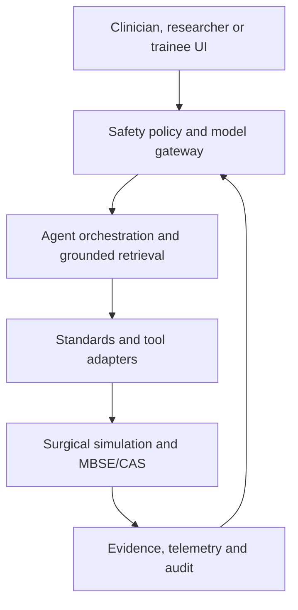
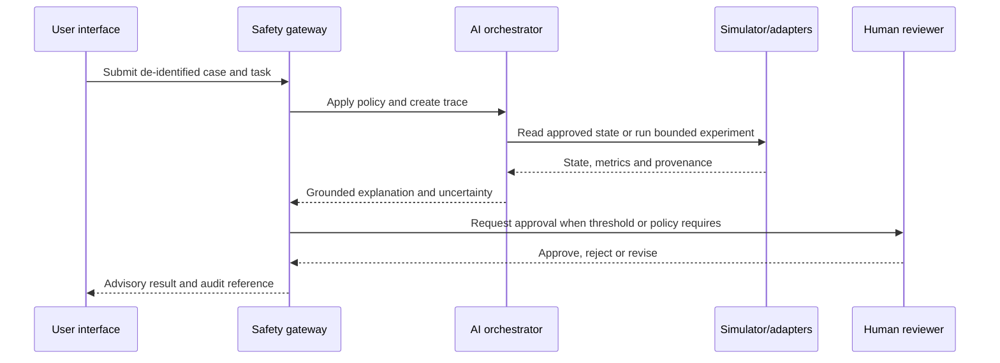

# AI-Powered Robotic Surgery Simulation Platform

> **Consolidated English project description, combined dual-degree curriculum integration, and proposed open-source AI integration architecture.**
>
> This repository is an MBSE-oriented design baseline for robotic-surgery simulation, medical imaging, physiology, biomechanics, and digital-engineering research. The AI architecture in this document is a proposal: it separates the artefacts that already exist in the repository from integrations that still require implementation, verification, and domain review.

## Table of Contents

- [Overview](#overview)
- [Project Status and Scope](#project-status-and-scope)
- [Engineering Objectives](#engineering-objectives)
- [Combined Dual-Degree Curriculum Architecture](#combined-dual-degree-curriculum-architecture)
  - [Phase 1: Common Trunk and Biomedical Innovation](#phase-1-common-trunk-and-biomedical-innovation-semesters-14)
  - [Phase 2: Clinical-Technical Medical Training](#phase-2-clinical-technical-medical-training-semesters-510)
  - [Phase 3: Clinical Medicine and Biomedical Internship](#phase-3-clinical-medicine-and-biomedical-internship-semesters-1114)
  - [Phase 4: Advanced Specialisation in Paediatric and Adolescent Gynaecology](#phase-4-advanced-specialisation-in-paediatric-and-adolescent-gynaecology-semesters-1518)
  - [Graduate Profile and Core Competencies](#graduate-profile-and-core-competencies)
- [Proposed AI Integration Architecture](#proposed-ai-integration-architecture)
  - [Layer Responsibilities](#layer-responsibilities)
  - [Safe Decision-Support Sequence](#safe-decision-support-sequence)
- [Code-Level Integration Contract](#code-level-integration-contract)
  - [Event and Data Contracts](#event-and-data-contracts)
- [AI Capability Profiles](#ai-capability-profiles)
- [Open-Source Technology Compendium](#open-source-technology-compendium)
  - [Surgical Robotics and Simulation Candidates](#surgical-robotics-and-simulation-candidates)
  - [Physiology, Biomechanics and Engineering Models](#physiology-biomechanics-and-engineering-models)
  - [Imaging, Vision and Learning Candidates](#imaging-vision-and-learning-candidates)
  - [Knowledge, Agents and Operations Candidates](#knowledge-agents-and-operations-candidates)
  - [Interoperability and Data Standards](#interoperability-and-data-standards)
- [Existing MBSE/CAS Assets](#existing-mbsecas-assets)
- [Proposed Repository Structure](#proposed-repository-structure)
- [Security, Privacy and Responsible AI](#security-privacy-and-responsible-ai)
- [Installation and Reproducibility (Current Baseline)](#installation-and-reproducibility-current-baseline)
- [Verification Strategy](#verification-strategy)
- [Roadmap](#roadmap)
- [Contribution Guidelines](#contribution-guidelines)
- [Disclaimer](#disclaimer)
- [Licensing and Provenance](#licensing-and-provenance)
- [Source References](#source-references)

---

## Overview

`jfxai4rss` brings together open and research-oriented technologies for surgical robotics, medical simulation, image guidance, physiological modelling, biomechanics, reinforcement learning, and 3D/VR training. The goal is to provide a traceable engineering workspace in which a surgical procedure can be modelled, simulated, evaluated, and improved without coupling the project to one vendor, one robot, or one inference provider.

The proposed AI layer provides decision support for simulation and engineering teams. It can retrieve approved knowledge, inspect simulation state, generate test hypotheses, explain model outputs, and prepare reproducible experiment configurations. It must not directly actuate a physical surgical robot, issue an autonomous clinical order, or be presented as a validated medical device without a separate regulatory, clinical, cybersecurity, and human-factors programme.

## Project status and scope

| Area | Current repository baseline | Proposed extension |
| --- | --- | --- |
| Systems engineering | MBSE/CAS artefacts using Draw.io, Modelio and Papyrus | Trace AI requirements, assumptions, hazards, interfaces and verification evidence to the system model |
| Surgical simulation | Candidate physics, physiology, imaging and robotic-surgery frameworks listed in the README | A common adapter boundary for simulation state, anatomy, instruments, sensors, forces and events |
| Artificial intelligence | Compendium of candidate vision, language, learning and agent technologies | A model gateway, grounded retrieval, tool-use policy, evaluation harness and human-approval workflow |
| Data and interoperability | Medical and engineering data sources are described conceptually | DICOM/DICOMweb, FHIR, ROS 2, OpenIGTLink and versioned event contracts where appropriate |
| Runtime | No single production runtime is asserted by the current repository | Local workstation, research cluster and controlled enterprise profiles with reproducible deployments |
| Safety | Research and training scope | Non-actuating defaults, de-identification, auditability, uncertainty thresholds and explicit review gates |

## Engineering objectives

1. **Model the system before implementation.** Keep requirements, architecture, interfaces, simulation assets and verification scenarios connected through MBSE artefacts.
2. **Make AI replaceable.** Access local, private-cloud or approved hosted models through one policy-aware gateway rather than embedding provider-specific calls in simulation code.
3. **Ground every meaningful answer.** Use retrieval and tool execution only against approved sources, simulation snapshots and versioned engineering artefacts.
4. **Preserve deterministic simulation.** AI may propose parameters or scenarios, but the simulator remains the authority for state transitions, physics and measured outcomes.
5. **Protect sensitive data.** Use de-identified or synthetic data by default, limit prompt payloads, encrypt data in transit and at rest, and record access decisions.
6. **Produce evidence, not only prose.** Store model versions, prompts or prompt hashes, retrieved sources, tool calls, simulator seeds, metrics, reviewer decisions and provenance.
7. **Keep the compendium modular.** Each upstream project is an optional candidate until its API, licence, maintenance status, performance and safety impact have been verified.

## Combined Dual-Degree Curriculum Architecture

To support the interdisciplinary requirements of high-precision robotic surgery, pediatric bio-instrumentation, and specialized medical practice, this project embeds an integrated academic curriculum combining **Biomedical Engineering** and **Human Medicine with Specialisation in Paediatric and Adolescent Gynaecology**.

┌──────────────────────────────────────────┐ │ PHASE 1: Common Trunk & Innovation │ Semesters 1 to 4 │ (Biomedical + Basic Medical Sciences) │ └────────────────────┬─────────────────────┘ ▼ ┌──────────────────────────────────────────┐ │ PHASE 2: Clinical-Technical Medicine │ Semesters 5 to 10 │ & Medical Engineering │ └────────────────────┬─────────────────────┘ ▼ ┌──────────────────────────────────────────┐ │ PHASE 3: Clinical Medicine & Externship │ Semesters 11 to 14 │ (Rotational Internship + Project) │ └────────────────────┬─────────────────────┘ ▼ ┌──────────────────────────────────────────┐ │ PHASE 4: Subspecialisation │ Semesters 15 to 18 │ (Paediatric Gynaecology + Bionano/Rob.) │ └──────────────────────────────────────────┘

### Phase 1: Common Trunk and Biomedical Innovation (Semesters 1–4)
* **Semester 1:** Differential and Integral Calculus; Integrated Molecular and Cellular Biology; General Human Anatomy and Dissection; Biomedical Engineering Fundamentals and Programming; Introduction to Paediatric Public Health.
* **Semester 2:** Multivariable Calculus and Differential Equations; Specialised Human Histology and Embryology; Linear Algebra and Basic Biomedical Signals; Inorganic Chemistry and Human Biochemistry; General Biomechanical Physiology.
* **Semester 3:** Electromagnetism and Biomedical Circuits; Genitourinary Embryogenesis and Development; Human Physiology I (Renal and Endocrine Systems); Soft Tissue Biomechanics and Biomaterials; Statistics and Quantitative Methods in Medicine.
* **Semester 4:** Neurophysiology and Human Physiology II; Biosignals and Biomedical Instrumentation; Medical Microbiology, Parasitology and Immunology; Medical Genetics and Biomolecular Biotechnology; Computational Methods in Biomedical Engineering.

### Phase 2: Clinical-Technical Medical Training (Semesters 5–10)
* **Semester 5:** Pathological Anatomy and Paediatric Pathophysiology; Microcontrollers and Medical Biotechnology; General Pharmacology and Toxicology; Pelvic Biomechanics and Body Fluid Dynamics; Medical Semiology I: Clinical Propedics.
* **Semester 6:** Paediatric Pharmacology and Biotransformation; Digital Medical Image Processing (Ultrasound, MRI, CT); Medical Semiology II and Surgical Diagnostics; Advanced Biomaterials and Tissue Engineering; Endocrine Genetics and Chromosomal Alterations.
* **Semester 7:** Paediatrics I: Growth, Development and Neonatology; Paediatric Medical Devices and Regulatory Frameworks; General Endocrinology and Pubertal Development; Digital Health, Telemedicine and AI in Healthcare; Medical Ethics, Bioethics and Deontology.
* **Semester 8:** Paediatrics II: Infectology and Paediatric Nutrition; Introduction to Human Gynaecology and Obstetrics; Gene Therapy and Surgical Molecular Biology; Advanced Surgical Instrumentation and Medical Robotics; Clinical Epidemiology and Trial Design.
* **Semester 9:** General Paediatric Surgery and Minimally Invasive Techniques; Gynaecological Endocrinology from Childhood to Puberty; Biological Sensors and Point-of-Care Testing (PoCT); Gynaecological Pathology and Paediatric Oncology; Legal Medicine and Child Protection.
* **Semester 10:** Advanced Diagnostic Imaging in Paediatric Gynaecology; Biomechanical Modelling of the Pelvic Floor and Surgical Meshes; Reproductive Health and Congenital Malformations Mapping; Research Methods and Medical Innovation; Prototyping Workshop and Customised Biomedical Devices.

### Phase 3: Clinical Medicine and Biomedical Internship (Semesters 11–14)
* **Semesters 11 & 12 (Rotational Medical Internship I):** Rotations through Paediatric Internal Medicine, Paediatric Surgery, General Obstetrics & Gynaecology, and Paediatric Emergencies/PICU.
* **Semesters 13 & 14 (Biomedical Internship & Clinical Research II):** Rotations through Medical Biotechnology Development Labs, Centre for Minimal Invasion and Paediatric Robotic Surgery; Clinical-Engineering Integration for Complex Cases; Capstone Thesis Project (Applied Medical Device or Algorithm).

### Phase 4: Advanced Specialisation in Paediatric and Adolescent Gynaecology (Semesters 15–18)
* **Semester 15:** Genital Development Anomalies and DSD Variations; Ultra-Minimally Invasive Paediatric Gynaecological Endoscopy & Laparoscopy; Microfluidic Devices for Capillary Blood Hormone Assays; Comprehensive Management of Müllerian Anomalies.
* **Semester 16:** Paediatric Gynaecological Oncology and Biocompatible Implants; Fertility Preservation in Paediatric Oncology Patients (Oncofertility); 3D Printing and Bioprinting of Reproductive Structures; Adolescent Gynaecology: Contraception and Bleeding Disorders.
* **Semester 17:** Genitourinary Reconstructive Neonatal and Paediatric Surgery; AI Applied to Ultrasonic Screening of Neonatal Ovaries; Advanced Bioethics in Genetic and Reconstructive Interventions; Intensive Clinical Practice in Paediatric Gynaecology Unit.
* **Semester 18:** International or Inter-institutional Rotation in Paediatric Robotic Surgery; Subspecialisation in Chronic Pelvic Pain and Adolescent Endometriosis; Health Technology Assessment (HTA) in Paediatric Gynaecology; Final Integrated Medical-Engineering Thesis Defence.

### Graduate Profile and Core Competencies

| Domain Area | Core Competency |
| :--- | :--- |
| **Diagnostics & Imaging** | Designs and interprets high-resolution Doppler ultrasound and reconstructed 3D CT/MRI for evaluating complex Müllerian malformations. |
| **Surgical Mastery** | Executes miniaturised robotic and laparoscopic procedures tailored to the anatomical metrics of neonates, children, and adolescents. |
| **Technological Innovation** | Engineers custom surgical instrumentation, biocompatible prosthetics, and biosensors for microscopic hormone detection. |
| **Integrated Clinical Care** | Manages complex conditions (Precocious/Delayed Puberty, DSD, PCOS, Paediatric Ovarian Masses) with a combined clinical-engineering approach. |


## Proposed AI integration architecture



### Layer responsibilities

| Layer | Responsibility | Candidate open-source building blocks | Status |
| --- | --- | --- | --- |
| User and training experience | Case setup, 3D/VR visualisation, replay, annotation, review and approval | JavaFX or web UI, VTK, SOFA, Godot/O3DE where justified | Proposed integration |
| Safety policy and model gateway | Authentication, authorisation, model selection, rate limits, data minimisation, uncertainty thresholds and non-actuation policy | Open Policy Agent or a comparable policy engine; local model runtime or an approved enterprise endpoint | Proposed integration |
| Agent orchestration | Plan bounded tasks, call allow-listed tools, maintain state, request human review and emit structured results | LangGraph/LangChain or a small project-owned state machine | Proposed integration |
| Grounded knowledge | Index approved guidelines, device manuals, MBSE models, experiment notes and simulator documentation | Qdrant or PostgreSQL/pgvector; document parsers; citation and provenance store | Proposed integration |
| Standards and tool adapters | Translate versioned contracts to imaging, clinical, robotics and simulation APIs | DICOM/DICOMweb, FHIR, ROS 2, OpenIGTLink, VTK, SOFA, Modelica, OpenSim, iMSTK | Proposed integration |
| Simulation and MBSE/CAS | Execute deterministic models, expose state snapshots, calculate metrics and retain artefacts | Existing `MBSE/CAS` Draw.io, Modelio and Papyrus assets plus selected simulators | Existing artefacts plus adapters |
| Evidence and operations | Metrics, traces, lineage, experiment registry, audit, incident review and reproducibility | OpenTelemetry, Prometheus, Grafana, MLflow or an equivalent registry | Proposed integration |

### Safe decision-support sequence



The default path is advisory and non-actuating. A tool call that could change a patient record, simulator baseline, robot command, or regulated configuration must be separately permissioned and normally require human approval.

## Code-level integration contract

The following interfaces are an implementation proposal, not a claim that these classes already exist in the repository. They keep AI, simulation, and external standards loosely coupled:

```java
public interface ModelGateway {
    InferenceResponse infer(InferenceRequest request, SafetyContext safety);
}

public interface KnowledgeRetriever {
    List<Evidence> search(String query, RetrievalScope scope);
}

public interface SimulationAdapter {
    SimulationSnapshot readSnapshot(CaseId caseId);
    SimulationResult run(ExperimentPlan plan, SimulationPolicy policy);
}

public interface ToolAdapter {
    ToolDescriptor descriptor();
    ToolResult invoke(ToolRequest request, ToolContext context);
}
```

Every implementation should expose a stable descriptor, input/output schema, capability scope, version, timeout, failure mode and provenance policy. The model gateway should return structured data rather than unvalidated free text:

```json
{
  "case_id": "case-2026-0001",
  "task": "compare two simulated instrument trajectories",
  "model": {"provider": "local-or-approved", "name": "versioned-model", "revision": "sha256:..."},
  "evidence": [{"source_id": "mbse-requirement-42", "retrieval_score": 0.91}],
  "simulation": {"snapshot_id": "snap-17", "seed": 4812, "software_revision": "git:..."},
  "assessment": {"label": "advisory", "confidence": 0.78, "uncertainty": 0.22},
  "recommended_next_step": "review the replay and approve the experiment plan",
  "requires_human_review": true,
  "provenance_id": "trace-..."
}
```

### Event and data contracts

Use versioned JSON/Avro/Protobuf contracts or equivalent schemas for events such as:

| Event | Minimum fields | Privacy and safety rule |
| --- | --- | --- |
| `case.created` | `case_id`, purpose, consent/profile, data classification, schema version | Reject direct identifiers in model prompts |
| `imaging.study.available` | DICOM study reference, modality, de-identification status, checksum | Permit only authorised studies and validated parsers |
| `simulation.snapshot.created` | snapshot ID, model revision, seed, time, state hash | Make the snapshot immutable and reproducible |
| `agent.plan.proposed` | plan ID, tools, parameters, expected outputs, risk class | Do not execute high-risk tools automatically |
| `review.required` | reason, evidence, uncertainty, reviewer role | Block the protected action until approval |
| `audit.recorded` | trace ID, actor, model/tool versions, decision, timestamp | Retain according to the applicable research or enterprise policy |

Suggested lifecycle states are `DRAFT`, `REVIEW_REQUIRED`, `APPROVED_FOR_SIMULATION`, `RUNNING`, `COMPLETED`, `REJECTED`, `QUARANTINED` and `AUDITED`. An idempotency key such as `(case_id, experiment_id, tool_version, input_hash)` prevents duplicate experiments.

## AI capability profiles

| Profile | Allowed capabilities | Deployment guidance |
| --- | --- | --- |
| Documentation assistant | Search and cite MBSE models, manuals and experiment notes; draft requirements and test cases | Local workstation or private service; no patient identifiers |
| Simulation analyst | Compare snapshots, generate bounded experiment plans, explain metrics and detect anomalies | Research workstation/cluster; deterministic seeds and reviewable plans required |
| Training coach | Provide scenario hints, replay summaries and competency feedback | Synthetic or de-identified cases; instructor override and event logging |
| Imaging research assistant | Propose segmentations, registrations or quality checks for human review | DICOM-aware sandbox; independent quantitative validation before any clinical interpretation |
| Robotics integration assistant | Inspect ROS 2/OpenIGTLink messages and verify interface contracts | Read-only by default; command publication disabled unless a separately approved test harness enables it |

## Open-source technology compendium

The compendium below consolidates the projects named in the original description and adds integration candidates required by the proposed architecture. A listed project is not automatically a dependency. Before adoption, verify the upstream licence, release health, API stability, security posture, hardware assumptions and suitability for the intended research or training context.

### Surgical robotics and simulation candidates

| Project or family | Intended role in the platform | Integration boundary |
| --- | --- | --- |
| Mobile Telemanipulator Robot Simulator (MTR-Sim) | Healthcare telemanipulator and procedure simulation | `SimulationAdapter`; expose state and metrics, never direct actuation |
| Sight / Surgical Image Guidance and Healthcare Toolkit | Medical-image visualisation and guidance workflows | DICOM/DICOMweb adapter plus VTK-compatible rendering |
| ORBIT-Surgical | Physics-based surgical-robot simulation | Deterministic experiment runner and snapshot exporter |
| VTK surgical simulation | Visualisation and geometric processing | VTK scene adapter and render/export service |
| `scikit-surgeryvtk` | VTK image fusion and calibrated OpenCV overlays | Imaging/reconstruction adapter; preserve calibration metadata |
| iMSTK | Real-time physics-based surgical simulation | Physics engine adapter and benchmark harness |
| SOFA Framework | Soft-tissue and interactive physics simulation | Scene adapter, force/constraint contract and replay recorder |
| SurRoL | Reinforcement-learning environment compatible with dVRK research | Offline training/evaluation adapter; no production robot control |
| OpenDR | Modular deep-learning robotics functions | Vision/pose inference adapter behind the model gateway |
| ROS-MED / ROS 2 ecosystem | Robotic middleware and message transport | Read-only telemetry bridge first; allow-list topics and message types |
| Surgeyos | Hardware, mechanical, electronic, software and AI reference ecosystem | Requirements and interface references; verify exact upstream components |

### Physiology, biomechanics and engineering models

| Project or family | Intended role | Integration boundary |
| --- | --- | --- |
| Physiomodel / Modelica human physiology | Quantitative physiological models | FMI/Modelica-compatible simulation adapter where available |
| Modelica Human Physiology libraries | Reusable physiology components | Versioned model package, parameter provenance and validation reports |
| OpenSim | Musculoskeletal modelling and dynamic motion simulation | Import/export adapter for kinematics, forces and clinical-research metrics |
| IntERAct | Time-synchronised tumour and external-surface motion | Time-series adapter with clock and calibration metadata |
| ModelFLOWs-cardiac | High-fidelity cardiac blood-flow/CFD studies | Batch experiment adapter; retain mesh, solver, boundary conditions and seed |
| Computational modelling of biomechanics and biotribology | Existing CAS design artefact | Link MBSE requirements to simulation scenarios and verification evidence |

### Imaging, vision and learning candidates

| Project or family | Intended role | Integration boundary |
| --- | --- | --- |
| FairCLIP | Fairness-aware vision-language evaluation | Offline benchmark; report subgroup metrics and limitations |
| OpenCV | Calibration, registration, image processing and computer vision | Deterministic image-processing service with calibration provenance |
| PyTorch or an equivalent open framework | Training and inference for research models | Model package registry, reproducible environment and evaluation suite |
| MONAI | Medical-imaging preprocessing, training and evaluation patterns | DICOM-aware research pipeline; de-identification before inference |
| ONNX Runtime | Portable inference for approved models | Model-format gateway with checksum and hardware profile |

### Knowledge, agents and operations candidates

| Project or family | Intended role | Integration boundary |
| --- | --- | --- |
| LangGraph / LangChain | Bounded stateful agent workflows and tool routing | Agent layer only; policy gateway remains authoritative |
| Qdrant or PostgreSQL/pgvector | Vector retrieval for approved knowledge | Evidence store with document version, access policy and citation IDs |
| Local model runtime or approved enterprise endpoint | Language/vision inference | Provider-neutral `ModelGateway`; keep prompts and outputs auditable |
| MCP-compatible tool interfaces | Discoverable, schema-described tools | Expose only allow-listed read or simulation tools; validate every call |
| OpenTelemetry | Distributed traces and model/tool spans | Trace ID propagated from UI to simulator and audit store |
| Prometheus and Grafana | Metrics, dashboards and alerts | Monitor latency, failure rate, uncertainty, drift and simulator health |
| MLflow or equivalent | Experiment and model registry | Store model revision, dataset reference, metrics and approval state |
| Open Policy Agent or equivalent | Policy-as-code for access and tool execution | Enforce data classification, role, environment and risk controls |

### Interoperability and data standards

| Standard | Use |
| --- | --- |
| DICOM / DICOMweb | Imaging objects, metadata, query/retrieve and web transport |
| HL7 FHIR | Research or enterprise exchange of structured health information where authorised |
| ROS 2 messages and services | Robotics telemetry, simulation state and controlled lab interfaces |
| OpenIGTLink | Image-guided-therapy and navigation data exchange when supported by the selected tools |
| FMI / Modelica exchange | Coupling physiology, mechanics and control models where the simulator supports it |
| JSON Schema, Avro or Protobuf | Versioned internal contracts and event validation |

## Existing MBSE/CAS assets

The current repository contains the following design artefacts under `MBSE/CAS`:

| Path | Purpose |
| --- | --- |
| `Drawio/Simulation-Manager.drawio` | Simulation-manager design and orchestration concept |
| `Drawio/computational-modelling-of-biomechanics-and-biotribology.drawio` | Biomechanics and biotribology modelling concept |
| `Modelio/robotic-surgery-system.di` and `.uml` | Modelio project for the robotic-surgery system |
| `Modelio/robotic-surgery-system.notation` | Modelio diagram notation |
| `Papyrus/robotic-surgery-simulation.di` and `.uml` | Papyrus project for robotic-surgery simulation |
| `Papyrus/robotic-surgery-simulation.notation` | Papyrus diagram notation |

The proposed AI work should add requirements, interfaces, threat models, data classifications, simulation scenarios and verification links to these artefacts instead of creating an isolated AI diagram.

## Proposed repository structure

The following folders are an implementation target; they do not imply that the folders already exist:

```text
.
├── MBSE/
│   └── CAS/
│       ├── Drawio/
│       ├── Modelio/
│       └── Papyrus/
├── contracts/
│   ├── events/
│   ├── imaging/
│   ├── robotics/
│   └── simulation/
├── curriculum/
│   ├── dual-degree-biomed-med/
│   └── paediatric-gynaecology/
├── ai/
│   ├── model-gateway/
│   ├── agents/
│   ├── retrieval/
│   ├── evaluation/
│   └── safety/
├── adapters/
│   ├── dicom-fhir/
│   ├── ros2-igtl/
│   ├── imaging/
│   ├── physiology-biomechanics/
│   └── simulation/
├── simulator/
│   ├── scenarios/
│   ├── seeds/
│   └── replay/
├── operations/
│   ├── observability/
│   ├── policies/
│   └── sbom/
├── docs/
│   ├── architecture/
│   ├── safety/
│   └── validation/
└── README.md
```

## Security, privacy and responsible AI

- Use synthetic or de-identified data for examples and training. Do not place direct identifiers or unrestricted clinical narratives in prompts, logs or vector stores.
- Apply least privilege and separate research, training, staging and production-like environments.
- Treat retrieved documents and tool responses as untrusted input; defend against prompt injection, data exfiltration and unsafe tool parameters.
- Require schema validation, bounds checking, timeouts, rate limits, replay protection and idempotency for every tool adapter.
- Record model/tool revisions, evidence IDs, simulation seeds, reviewer identity, policy decisions and failed calls.
- Evaluate accuracy, calibration, subgroup performance, robustness, latency and failure recovery. A plausible explanation is not evidence of clinical correctness.
- Keep robot-command publication disabled in the default profile. Any future actuation study requires a physically isolated test rig, independent safety controller, emergency stop, qualified reviewers and a separate approval record.
- Publish an SBOM and review the licence and security posture of every dependency, model, dataset, container and hardware SDK.

## Installation and reproducibility (current baseline)

The current repository is primarily a design and modelling workspace; it does not advertise one complete runnable application or clinical deployment. To inspect the baseline:

```bash
git clone https://github.com/robotics-intelligent-systems/jfxai4rss.git
cd jfxai4rss
```

Open the Draw.io files with a compatible Draw.io desktop/web release and open the Modelio/Papyrus projects with their corresponding tools. Proposed adapters and AI services should add their own pinned environment, test fixtures, sample data policy, and reproducible command sequence before being described as supported.

## Verification strategy

1. **Contract tests:** validate DICOM/FHIR/ROS 2/OpenIGTLink and simulation schemas against versioned fixtures.
2. **Determinism tests:** run identical experiments with fixed seeds and compare state hashes, metrics and exported artefacts.
3. **Model tests:** measure task accuracy, calibration, bias, hallucination rate, latency and resource use on a documented evaluation set.
4. **Tool-safety tests:** reject malformed, out-of-range, unauthorised, duplicate and replayed calls.
5. **Human-factors tests:** verify that reviewers understand uncertainty, evidence, override controls and failure states.
6. **Security tests:** scan dependencies and containers, test prompt-injection resistance, verify access policies and inspect audit completeness.
7. **Traceability review:** link every safety-relevant requirement to an implementation element, test, result and reviewer decision in the MBSE/CAS record.

## Roadmap

| Phase | Deliverable | Exit evidence |
| --- | --- | --- |
| 0. Baseline | Inventory current MBSE/CAS artefacts and compendium licences | Repository map, dependency ledger and open issues |
| 1. Contracts | Define case, imaging, simulation, event and audit schemas | Schema tests and sample fixtures with synthetic data |
| 2. Gateway | Implement provider-neutral model gateway and policy boundary | Local inference smoke test, access tests and trace IDs |
| 3. Retrieval and agents | Add cited retrieval and bounded, allow-listed workflows | Evidence-linked responses and tool-denial tests |
| 4. Simulation bridge | Connect one simulator through a read-only adapter | Reproducible snapshot/replay and deterministic metrics |
| 5. Evaluation | Add model, fairness, robustness and human-review benchmarks | Published evaluation report and acceptance thresholds |
| 6. Training pilot | Deliver a non-clinical scenario with instructor controls | Safety review, usability results and incident playbook |
| 7. Extended validation | Consider additional modalities or controlled hardware research | Separate regulatory, clinical, cybersecurity and ethics approvals |

## Contribution guidelines

Contributions should state whether a change is implemented, experimental or architectural. Include the affected contract, threat model, upstream version, licence, test evidence and reproducibility instructions. New AI tools must declare their capabilities, data access, side effects, timeout, failure behaviour and human-review requirement.

## Disclaimer

This project is intended for open-source engineering research, education, simulation and training. It is not medical advice, a diagnostic system, a treatment recommendation, a certified medical device, or a substitute for qualified clinical, safety, regulatory or ethics review. The presence of an upstream project in this compendium does not imply endorsement, interoperability, maintenance, certification or clinical suitability.

## Licensing and provenance

The inspected repository baseline did not expose a root `LICENSE` file. Add a project licence before distributing original code, and preserve the notices and licences of every upstream project. “Open source” does not mean that all models, datasets, dependencies, containers or hardware SDKs share the same terms. Record exact versions, source URLs, checksums where practical, attribution and an SBOM for each release.

## Source references

- [jfxai4rss repository](https://github.com/robotics-intelligent-systems/jfxai4rss)
- [DICOM standard](https://www.dicomstandard.org/)
- [HL7 FHIR](https://hl7.org/fhir/)
- [ROS 2 documentation](https://docs.ros.org/)
- [OpenIGTLink](https://www.openigtlink.org/)
- [VTK](https://vtk.org/)
- [`scikit-surgeryvtk`](https://github.com/UCL/scikit-surgeryvtk)
- [SOFA Framework](https://www.sofa-framework.org/)
- [iMSTK](https://github.com/KitwareMedical/iMSTK)
- [SurRoL](https://github.com/med-air/SurRoL)
- [OpenDR](https://github.com/opendr-eu/opendr)
- [OpenSim](https://opensim.stanford.edu/)
- [Modelica Association](https://modelica.org/)
- [MONAI](https://monai.io/)
- [ONNX Runtime](https://onnxruntime.ai/)
- [LangGraph](https://langchain-ai.github.io/langgraph/)
- [Qdrant](https://qdrant.tech/)
- [OpenTelemetry](https://opentelemetry.io/)
- [Prometheus](https://prometheus.io/)
- [MLflow](https://mlflow.org/)
- [Open Policy Agent](https://www.openpolicyagent.org/)

